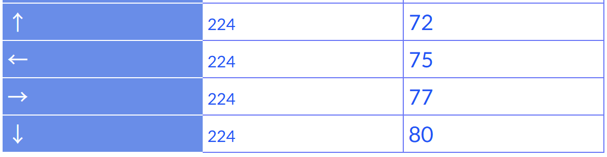

# Tetris
24.12.17~      SSAFY project


## 24.12.17
테트리스 메인메뉴 만들기

```C++
#include<iostream> //입출력
#include<vector> //벡터
using namespace std;

#define TABLE_X 20 // X축 길이 = 20
#define TABLE_Y 30 // Y축 길이 = 30

class MainMenu {
public:
	MainMenu() {
        cout << "\n\n\n\n";
        cout << "\t\t"; cout << "@@@@@@@@@@@@  @@@@@@@@@   @@@@@@@@@@@  @@@@@@@@   @   @@@@@@@@@@@\n";
        cout << "\t\t"; cout << "      @       @                @       @      @   @   @          \n";
        cout << "\t\t"; cout << "      @       @                @       @      @   @   @          \n";
        cout << "\t\t"; cout << "      @       @@@@@@@@@        @       @     @    @   @@@@@@@@@@@\n";
        cout << "\t\t"; cout << "      @       @                @       @ @ @      @             @\n";
        cout << "\t\t"; cout << "      @       @                @       @     @    @             @\n";
        cout << "\t\t"; cout << "      @       @@@@@@@@@        @       @      @   @   @@@@@@@@@@@\n\n\n\n\n";
        cout << "\t\t"; cout << "                게임을 시작하려면 아무키나 누르세요.\n\n\n\n\n\n\n";
        cout << "\t\t\t"; cout << "                   TetrisGame1.0\n";
        getchar(); // 키 입력을 기다림
        system("cls"); // 콘솔 창 정리
	}
};


class GameTable {
private:
    int x;
    int y;
    vector<vector<int> > table; // 동적 2차원배열(정수를 저장하는)
public:
    GameTable(int x, int y) {
        this->x = x; // 변수 명이 같아 충돌을 피하기 위해 현재 객체 주소를 가르키는 포인터(this)를 사용
        this->y = y;
        for (int i = 0; i < y; i++) {
            vector<int> temp; //임시temp 벡터를 생성
            for (int j = 0; j < x; j++) {
                temp.push_back(0); //벡터에 0추가 < 길이가j인 벡터 생성
            }
            table.push_back(temp); //table에 temp벡터를 i개 추가해 뼈대 생성
        }
        //가장 자리 뼈대 색칠할 곳을 1로 채움
        for (int i = 0; i < x; i++) {
            table[0][i] = 1;
            table[y - 1][i] = 1;
        }
        for (int i = 1; i < y - 1; i++) {
            table[i][0] = 1;
            table[i][x - 1] = 1;
        }
    }
    /*게임판 그리는 함수*/
    void DrawGameTable() {
        for (int i = 0; i < y; i++) {
            for (int j = 0; j < x; j++) {
                if (table[i][j] == 1)cout << "▦";
                else cout << "  "; // 두 칸 띄우기
            }
            cout << "\n";
        }
    }
};


int main() {
    system("mode con cols=100 lines=40 | title 테트리스 게임"); // 콘솔창 크기 및 제목 설정
    GameTable gt(TABLE_X, TABLE_Y); //게임 판 그리기 객체 생성
    MainMenu();
    gt.DrawGameTable(); // 게임판을 그린다.
    getchar();
	return 0;
}
```

## 1일차 학습내용

### 1. Private & Public

Public (공개 접근 제어자) : 외부에서 접근이 가능, 클래스 외부에서도 해당 멤버 변수나 멤버 함수를 사용할 수 있다.

Private (비공개 접근 제어자) : 클래스 내부에서만 접근 가능, 클래스 외부에서는 해당 멤버 변수나 멤버 함수에 접근할 수 없다.

### 2. void

void 는 함수의 반환형을 의마한다.

함수의 반환형이란?<br>
    - 함수가 실행된 후 반환하는 값의 자료형<br>
    - 반환값이 없으면 void를 사용

ex)
```c++
void DrawGameTable() {
    for (int i = 0; i < y; i++) {
        for (int j = 0; j < x; j++) {
            if (table[i][j] == 1) cout << "▦";
            else cout << "  ";
        }
        cout << "\n";
    }
}
// 위 함수는 반환값이 없음 

int Add(int a, int b) {
    return a + b; // 반환값이 int형
}
// 위 함수는 반환값이 있음 (반환형 자료에 대해 자료형을 명시해줘야함)
```
### 3. vector

벡터 선언
```c++
vector<int>; //1차원 벡터를 저장하는 구조(동적)
vector<vector<int> >; //2차원 벡터

vector<int>v(4); //int형 벡터 생성 후 크기를 4로 할당
vector<int>v = {1,2,3}; //int형 벡터 배열 생성후 1, 2, 3 으로 초기화

```

### 4. this를 사용하는 이유

```c++
// this는 현재 객체의 주소를 가리키는 포인터
this->x = x; // 변수 명이 같아 충돌을 피하기 위해 현재 객체 주소를 가르키는 포인터(this)를 사용
this->y = y;

class GameTable {
private:
    int x; // 멤버 변수 x
    int y; // 멤버 변수 y
public:
    GameTable(int x, int y) { // 생성자의 매개변수 x와 y
        this->x = x; // 멤버 변수 x에 매개변수 x 값을 대입
        this->y = y; // 멤버 변수 y에 매개변수 y 값을 대입
    }
};

```
<br>
<hr>
<br>

## 24.12.18
블럭생성, 낙하, 회전

## 2일차 학습내용

### 1. #include<conio.h>

콘솔 입출력 관련 함수들을 제공<br>
getch() : 키보드 입력을 한 문자 단위로 읽고, 화면에 표시하지 않음<br>
kbhit() : 키보드 입력이 있는지 확인<br>
getche() : 키보드 입력을 읽고, 화면에 표시<br>



### 2. #include <windows.h>

도스 창을 제어하기 위한<br>
콘솔 창 제어, 윈도우 창 생성, 메시지 처리 등

### 3. #include <cstdlib>

 C라이브러리의 유틸리티 함수들을 제공<br>

 rand() : 0에서 RAND_MAX 사이의 난수를 생성

 ### 4. #include <ctime>

 시간과 날짜와 관련된 함수를 제공

 ### 5. 블럭생성
 ```c++
/*블럭 생성*/
void createBlock() {
    srand((unsigned int)time(NULL));
    int select = rand() % 5 + 1; // 1 ~ 5 블럭
    if(select == 1) blockObject = new Block1(); // 1번 블럭 생성
    else if(select == 2)blockObject = new Block2(); // 2번 블럭 생성
    else if (select == 3)blockObject = new Block3(); // 3번 블럭 생성
    else if (select == 4)blockObject = new Block4(); // 4번 블럭 생성
    else if (select == 5)blockObject = new Block5(); // 5번 블럭 생성

    for (int i = 0; i < 4; i++) {
        for (int j = 0; j < 4; j++) {
            int Y = j + blockObject->getY();
            int X = i + blockObject->getX(); 
            table[Y][X] = blockObject->getShape(blockObject->getRotationCount(), i, j);
            //블럭 객체를 테이블에 업데이트
        }
    }
    }
 ```